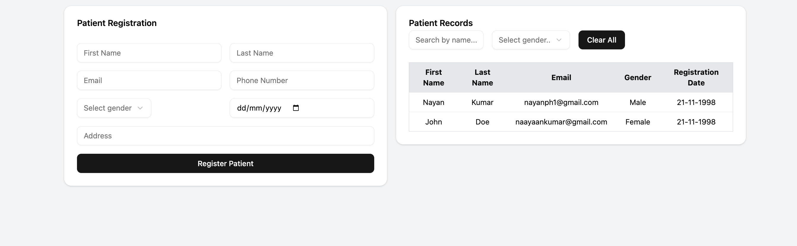
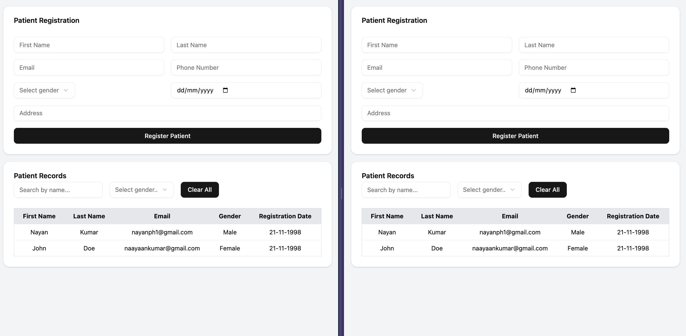

# Patient Registry App

## Project Overview

This application allows users to register patients using a form and view the records in a list format. Users can also sort and filter the patient list based on name and gender. It supports **live updates** across multiple browser tabs using the reactive nature of **PGlite** and updates the data in real time by identifying changes in the database.

### Tech Stack

- **Frontend**: React, Shadcn, TailwindCSS
- **Database**: PGlite (indexedDB) (PostgreSQL running in the browser via WebAssembly)

PGlite enables PostgreSQL to run entirely in the browser using a `.wasm` binary format, which makes it ideal for offline and reactive applications.

---

## Features

- Add new patient records
- Filter records by name and gender
- Live updates when new records are added
- Multi-tab support for real-time data syncing
- Form validation
- Debounced input handling (to reduce load)
- Responsive for all Screens

---

## Learning Outcomes

This was my first time using PGlite, and I learned a lot while building this project:

1. How a database written in C/Clang can be compiled to WebAssembly and run inside a browser.
2. Understanding the **reactive nature** of PGlite.
3. How PGlite uses **IndexedDB** to persist data in the browser.
4. How to bundle the application into separate chunks for better performance.
5. Implementing **multi-tab support** using web workers (`PGliteWorker`).
6. Writing **live queries** that auto-update on database changes.
7. The potential of PGlite as a developer tool for unit testing and microservice-based development environments.

---

## Challenges Faced

1. **Multi-tab live updates**:  
   I initially tried using the **Broadcast Channel API** to sync data across tabs, but it didn't work as expected. I then switched to using `PGliteWorker` from the PGlite library to enable real-time updates across tabs, which worked well.

2. **Bundle size issues**:  
   When bundling the application for production, the size exceeded limits. I resolved this by creating a separate build optimized for production use.

3. **Development optimization**:  
   I faced issues with Vite's pre-bundling process. To fix this, I excluded certain libraries from pre-bundling during development and manually included them during production:

```ts
   optimizeDeps: isDevMode
     ? {
         exclude: ["@electric-sql/pglite", "@electric-sql/pglite-react"],
       }
     : {
         include: ["@electric-sql/pglite", "@electric-sql/pglite-react"],
       },
```

This ensured smoother development without build-time issues.

## Known Limitations and Key learnings from PGlite Github

When using this application on mobile browsers, please be aware of the following limitations:

- **Memory Requirements**: PGLite requires substantial memory allocation (tests show 347MB+ usage even with minimal data)
- **iOS Safari Constraints**: iOS Safari imposes strict memory limits that cause the application to crash when using PGLite
- **Official Documentation**: The PGLite documentation acknowledges these mobile browser limitations
- **Ongoing Development**: This issue is being actively discussed by PGLite developers (reference: [GitHub issue #408](https://github.com/electric-sql/pglite/issues/408))

## Folder Structure

```
src/
├── assets/
├── components/
│   └── ui/
│       ├── PatientForm.tsx
│       ├── PatientRecords.tsx
│       └── Sort-and-filter.tsx
├── lib/
│   ├── formater.ts
│   ├── test-data.ts
│   ├── types.ts
│   ├── utils.ts
│   └── Validater.ts
├── App.css
├── App.tsx
├── index.css
├── main.tsx
├── multi-tab-pglite-worker.ts
└── vite-env.d.ts
```

---

## Future Improvements

1. Implementing grid filtering
2. Add Pagination or Infinite Scrolling

---

## Demo

#### Data-Entry form



#### Multi-tab support for real-time data syncing



---

## Setup Instructions

### Prerequisites

- Node.js >= 18

(No backend or external database setup required since PGlite runs entirely in the browser.)

### Running Locally

```bash
# Clone the repository
git clone https://github.com/NAYANKUMAR21/medblocks-project.git

# Go into the project directory
cd medblocks-project

# Install dependencies
npm install

# Start the development server
npm run dev
```

### Thank you ...
